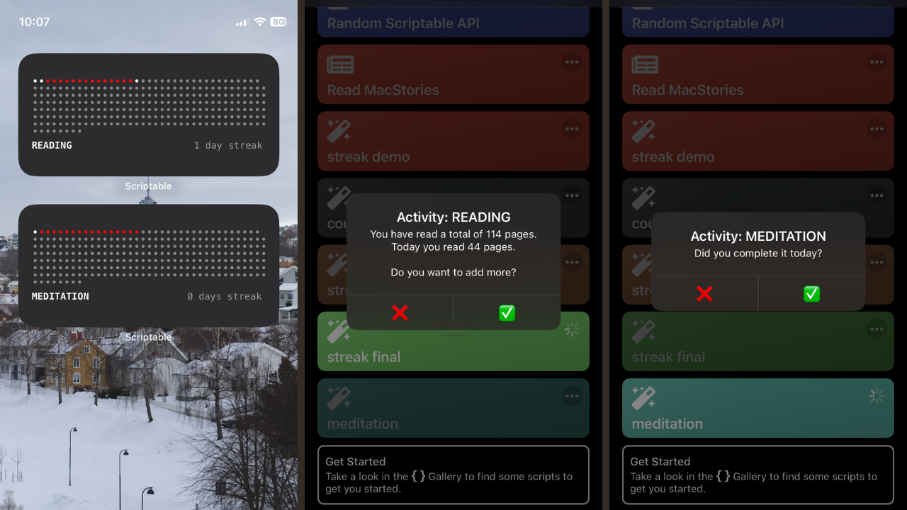

# 📚 Streak Widget for Iphone

This project is a customizable **iOS widget** built with **Scriptable** that tracks daily progress for a specific activity like **reading**, **meditation**, or **sports**.  
It visually displays your progress as a grid of dots — marking completed, missed, and future days — and keeps a live count of your current activity streak.

This project is inspired by [jvscholz](https://www.youtube.com/@jvscholz/videos).

---

### ✨ Features
- Choose your activity: Reading, Meditation, or Sports.
- Logs daily progress with detailed tracking (pages read, minutes meditated, etc.).
- Displays a clear visual timeline of your year with colored dots.
- Automatically updates streak count based on consecutive completed days.

---

### ⚙️ Setup
1. Install [Scriptable](https://scriptable.app/) on your iOS device.
2. Copy this script into Scriptable.
3. Customise the configuration section at the top of the file:
   - Set your `ACTIVITY_NAME` (e.g., `"READING"`)
   - Choose a `START_DATE`
   - Adjust widget appearance if needed.
4. Add a Scriptable widget to your Home Screen and select this script.
5. Long-press on the widget and click **Edit Widget**.
6. Select the pasted script's name in the **Script** option and set *Run Script* for the **When Interacting** option

---

### 🖼️ Example Screenshot

> Here's what the widget looks like in action:

---

### 📝 Notes
- You can manually update your progress by running the script directly in Scriptable.
- Progress data for each activity type is stored safely in your iCloud Drive.
---

### 📄 License
This project is licensed under the MIT License.

